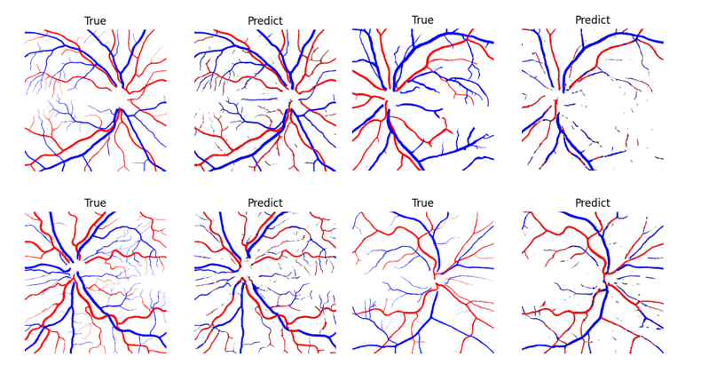

# **Crow Net**
**망막의 시신경으로부터 정맥과 동맥 구분하는 Semactic Segmentation model 만들기**

## **Idea**
1. Re-activation blcok
2. VA loss

**Keywords: Semantic Segmentation, Data Augmentation, SE-Net, Retinal vessel, artery, vein**


## 

## **Conclusion**


## Data Usage Agreement / Citations

The RAVIR dataset is distributed under the **Attribution-NonCommercial-ShareAlike 4.0 International (CC BY-NC-SA 4.0)** License and may only be used for non-commercial purposes.

Please cite the following manuscripts if you use the RAVIR dataset:

1. Hatamizadeh, A., Hosseini, H., Patel, N., Choi, J., Pole, C., Hoeferlin, C., Schwartz, S., and Terzopoulos, D. (2022). "RAVIR: A Dataset and Methodology for the Semantic Segmentation and Quantitative Analysis of Retinal Arteries and Veins in Infrared Reflectance Imaging." *IEEE Journal of Biomedical and Health Informatics*.

2. Hatamizadeh, A. (2020). "An Artificial Intelligence Framework for the Automated Segmentation and Quantitative Analysis of Retinal Vasculature." *University of California, Los Angeles*.

### Citation Format

```bibtex
@article{hatamizadeh2022ravir,
  title={RAVIR: A Dataset and Methodology for the Semantic Segmentation and Quantitative Analysis of Retinal Arteries and Veins in Infrared Reflectance Imaging},
  author={Hatamizadeh, Ali and Hosseini, Hamid and Patel, Niraj and Choi, Jinseo and Pole, Cameron and Hoeferlin, Cory and Schwartz, Steven and Terzopoulos, Demetri},
  journal={IEEE Journal of Biomedical and Health Informatics},
  year={2022},
  publisher={IEEE}
}
```

## References 
[1] Ronneberger, O., Fischer, P., & Brox, T. (2015). U-net: Convolutional networks for biomedical image segmentation. In Medical image computing and computer-assisted intervention–MICCAI 2015: 18th international conference, Munich, Germany, October 5-9, 2015, proceedings, part III 18 (pp. 234-241). Springer international publishing.

[2] Hu, J., Shen, L., & Sun, G. (2018). Squeeze-and-excitation networks. In Proceedings of the IEEE conference on computer vision and pattern recognition (pp. 7132-7141).

[3] Zhou, Y., Xu, M., Hu, Y., Blumberg, S. B., Zhao, A., Wagner, S. K., ... & Alexander, D. C. (2024). CF-Loss: Clinically-relevant feature optimised loss function for retinal multi-class vessel segmentation and vascular feature measurement. Medical Image Analysis, 93, 103098.

[4] Acebes, C., Moustafa, A. H., Camara, O., & Galdran, A. (2024, October). The Centerline-Cross Entropy Loss for Vessel-Like Structure Segmentation: Better Topology Consistency Without Sacrificing Accuracy. In International Conference on Medical Image Computing and Computer-Assisted Intervention (pp. 710-720). Cham: Springer Nature Switzerland.

[5] Hatamizadeh, A., Hosseini, H., Patel, N., Choi, J., Pole, C. C., Hoeferlin, C. M., ... & Terzopoulos, D. (2022). RAVIR: A dataset and methodology for the semantic segmentation and quantitative analysis of retinal arteries and veins in infrared reflectance imaging. IEEE Journal of Biomedical and Health Informatics, 26(7), 3272-3283.

[6] Patton, N., Aslam, T., MacGillivray, T., Pattie, A., Deary, I. J., & Dhillon, B. (2005). Retinal vascular image analysis as a potential screening tool for cerebrovascular disease: a rationale based on homology between cerebral and retinal microvasculatures. Journal of anatomy, 206(4), 319-348.
